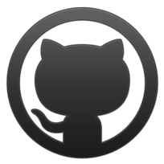

# **Gitwar - Compete with Github**

   

- 
- 👋 Hi, I’m @ripalnakiya
- 👀 I’m interested in Web development
- 🌱 I’m currently learning ReactJS
- 💞️ I’m looking to collaborate on ...
- 📫 How to reach me ...

<!---
ripalnakiya/ripalnakiya is a ✨ special ✨ repository because its `README.md` (this file) appears on your GitHub profile.
You can click the Preview link to take a look at your changes.
--->
